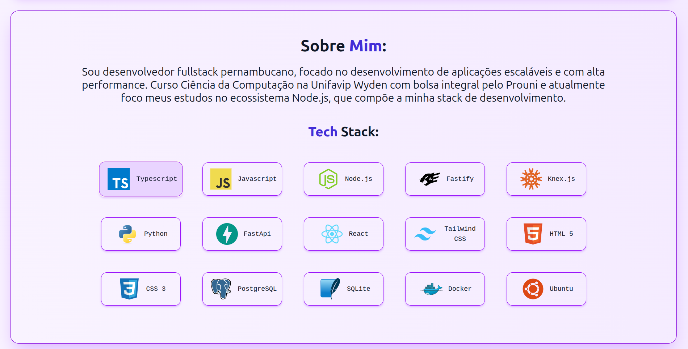
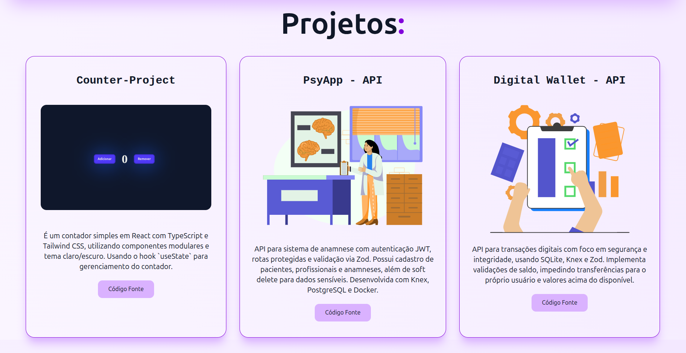

# 💼 Meu Portfólio Pessoal

Primeiro projeto desenvolvido com **React** e **Tailwind CSS**! Este portfólio representa meu aprendizado inicial com essas tecnologias modernas e marca o início da minha jornada no desenvolvimento frontend.

## 🚀 Tecnologias Utilizadas

- **React 19** - Biblioteca para construção de interfaces
- **TypeScript** - Tipagem estática para maior segurança
- **Tailwind CSS 4** - Framework CSS utilitário
- **Vite** - Build
- **Lucide React** - Ícones elegantes

## 📚 Aprendizados

Este projeto foi fundamental para:
- Compreender a estrutura de componentes do React
- Dominar as classes utilitárias do Tailwind CSS
- Organizar uma aplicação em componentes reutilizáveis

## 📸 Demonstração

### Início


### Sobre Mim


### Projetos


## 🎯 Estrutura do Projeto

```
src/
├── components/
│   ├── Header/
│   ├── About/
│   └── Projects/
├── App.tsx
└── main.tsx
```

## ⚙️ Como Executar

```bash
git clone <seu-repositorio>

npm install

npm run dev
```

### - Desenvolvido com dedicação durante meu aprendizado em React e Tailwind CSS
